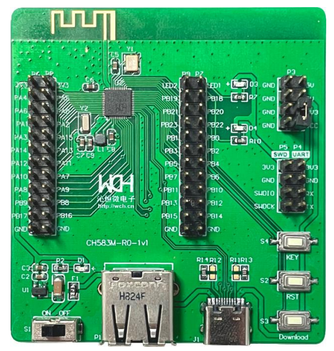

# Port TinyMaix to CH582

## Chip

| Item  | Parameter              |
| ----- | ---------------------- |
| Chip  | CH582                  |
| Arch  | RV32 IMAC (QingKe V4A) |
| Freq  | 60M                    |
| Flash | 448KB                  |
| RAM   | 32KB                   |

## Board 

CH582EVT

## Development Environment
cmake
## How to Build
1. Install cmake and add the tool chain of MounRiver Studio to the environment variable of the system
2. Open the terminal under the project folder and run source env.sh
3. cd examples/ch58x
4. make
## Result

| config | mnist | Note |
| ------ | ----- | ---- |
| O1 CPU | 37.1  |      |
| O2 CPU | 36.7  |      |

## Author

[HaiMianBBao](https://github.com/HaiMianBBao) 
